<div align="center">



<p>
  <a href="https://arxiv.org/abs/2605.25038"></a>
</p>

</div>

A 2,999-example synthetic instruction-tuning dataset for two clinical tasks in Applied Behavior Analysis: **teaching-program generation** and **behavioral session interpretation**. Every example is generated from a taxonomy grounded in the canonical ABA literature (Cooper, Heron, & Heward 2020; VB-MAPP; AFLS; BACB Ethics Code 2020) and carries full sampling provenance — the exact taxonomy cells that produced it.

| | |
|---|---|
| **Version** | v1.0.0 |
| **Examples** | 2,999 (2,549 train / 149 valid / 281 test / 20 sanity) |
| **Tasks** | Teaching-program generation (DTT, NET, Task Analysis); behavioral session interpretation (12 patterns, 13 target behaviors) |
| **Language** | English (US clinical register) |
| **Data license** | CC BY-NC 4.0 |
| **Code license** | MIT |
| **Maintainer** | Pombo Labs — [GitHub](https://github.com/Pombo-Labs) · [Hugging Face](https://huggingface.co/PomboLabs) |
| **Author** | Festus Kahunla |

---

## What this is for

ABA is a clinical discipline with high documentation workload. Board Certified Behavior Analysts (BCBAs) draft teaching programs and interpret multi-session behavioral logs constantly across their caseloads. TRACE is a **research** dataset for studying whether small language models can learn the structure of those documents well enough to produce useful first-pass drafts. It is a research artifact, not a clinical tool.

Real session data is HIPAA-protected and gated by BACB confidentiality rules; it cannot be reliably de-identified without losing clinical detail. TRACE avoids the constraint by construction: the data never represented a real person.

## What makes TRACE different

1. **Two tasks in one dataset.** Structured teaching-program generation across DTT, NET, and Task Analysis; multi-session interpretation across 12 clinical trajectory patterns.
2. **Taxonomy-grounded.** Every category in the controlled vocabulary ties to a specific source — Cooper/Heron/Heward chapters, JABA papers, VB-MAPP/AFLS curricula, BACB Ethics Code 2020, ABAI 2010 Position Statement.
3. **Full provenance per example.** `meta.provenance.taxonomy_cells` records the exact values sampled from every taxonomy dimension that produced the example. This is the property that makes clinical auditing tractable.
4. **Practitioner-in-the-loop iteration.** Clinical accuracy was refined through targeted taxonomy edits rather than per-example rewrites — each flagged inaccuracy maps to a single cell whose fix then propagates across every example that sampled it.

## Quick start

```bash
# Load with Hugging Face datasets
from datasets import load_dataset
ds = load_dataset("PomboLabs/TRACE")
print(ds["train"][0])
```

Or from the raw JSONL splits:
```python
import json
for line in open("data/splits/train.jsonl"):
    example = json.loads(line)
    system, user, assistant = example["messages"]
    gold = example["meta"]["gold_labels"]
    provenance = example["meta"]["provenance"]["taxonomy_cells"]
```

### Extend the generator

The taxonomy YAMLs under `configs/` are the fork point — drop in a new teaching method, a new clinical area, or a new behavioral pattern, regenerate, and you have a corpus tailored to your scope.

```bash
uv pip install -e .
uv run python src/generate.py --all
uv run python src/split_data.py
uv run python src/prepare_curation.py
uv run python src/compile_curation.py
```

(Without `uv`: `pip install -r requirements.txt` and drop the `uv run` prefix.)

The pipeline is deterministic, so the same configs + seed produce the same corpus — but the more interesting use is to make your own.

## Repository structure

```
.
├── configs/                     # taxonomy YAMLs (controlled vocabulary)
│   ├── shared/                    # cross-area: learner profiles, mastery states
│   ├── dtt/                       # DTT taxonomy + template + compatibility
│   ├── net/                       # NET area
│   ├── task_analysis/             # chaining (independence + toleration)
│   └── session_interpretation/    # patterns, behaviors, trajectories, recommendations
├── src/
│   ├── generators/                # per-area generator code
│   ├── generate.py                # orchestrator
│   ├── split_data.py              # train / valid / curation_pool
│   ├── prepare_curation.py        # browseable review.md
│   └── compile_curation.py        # test + sanity splits
├── data/splits/                 # the released JSONL splits
└── docs/
    ├── dataset-card.md          # HF-style user-facing card
    ├── datasheet.md             # Gebru et al. (2021) template
    ├── data-statement.md        # Bender & Friedman (2018) template
    ├── taxonomy-v1.md           # operational definitions + citations
    ├── schema-v1.md             # wire format + slot specifications
    ├── references.md            # the focused citation shortlist (~30 papers)
    └── curation/
        ├── README.md            # review + compile workflow
        └── LEGEND.md            # session-log notation reference
```

## Documentation

| | |
|---|---|
| **Dataset card** | [docs/dataset-card.md](docs/dataset-card.md) |
| **Datasheet** (Gebru et al. 2021) | [docs/datasheet.md](docs/datasheet.md) |
| **Data statement** (Bender & Friedman 2018) | [docs/data-statement.md](docs/data-statement.md) |
| **Taxonomy reference** | [docs/taxonomy-v1.md](docs/taxonomy-v1.md) |
| **Schema reference** | [docs/schema-v1.md](docs/schema-v1.md) |
| **Curation workflow** | [docs/curation/README.md](docs/curation/README.md) |
| **Session-log reading guide** | [docs/curation/LEGEND.md](docs/curation/LEGEND.md) |

## Ethics and intended use

- **For:** fine-tuning small models (recommended: Gemma 4 E2B, QLoRA, 4-bit) for on-device drafting assistants, evaluation baselines, research on clinical-NLP data pipelines.
- **Not for:** autonomous clinical decisions; writing final Behavior Intervention Plans without BCBA review; training models on real client data; medical diagnosis; insurance documentation.

Crisis-plan content is deliberately conservative: physical-intervention procedures are not specified because they vary by jurisdiction, training certification, and learner-specific contraindications. See [docs/dataset-card.md section 6.3](docs/dataset-card.md) for details.

**Responsibility.** TRACE is a research artifact. It is not a clinical tool, has not been clinically validated, and carries no clinical endorsement. Anyone who chooses to deploy TRACE — or any model derived from it — in a clinical setting does so entirely at their own responsibility and under their facility's own oversight. The authors and Pombo Labs make no representation of clinical suitability and accept no liability for clinical outcomes.

## License

- **Data** — JSONL splits under `data/splits/` — Creative Commons Attribution-NonCommercial 4.0 (CC BY-NC 4.0). Research and non-commercial use permitted with attribution. See [LICENSE-DATA](LICENSE-DATA).
- **Code** — generator, scripts, configs — MIT. See [LICENSE-CODE](LICENSE-CODE).

## Citation

**Paper:**

```bibtex
@misc{kahunla2026tracetaxonomygroundedsyntheticdataset,
  title         = {TRACE: A taxonomy-grounded synthetic dataset for teaching-program generation and session interpretation in Applied Behavior Analysis},
  author        = {Festus Kahunla},
  year          = {2026},
  eprint        = {2605.25038},
  archivePrefix = {arXiv},
  primaryClass  = {cs.CL},
  url           = {https://arxiv.org/abs/2605.25038}
}
```

**Dataset:**

```bibtex
@dataset{trace_2026,
  title     = {TRACE: Taxonomy-Referenced ABA Clinical Examples},
  author    = {Kahunla, Festus},
  year      = {2026},
  publisher = {Pombo Labs},
  url       = {https://github.com/Pombo-Labs/TRACE},
  note      = {Version 1.0.0}
}
```

Machine-readable metadata in [CITATION.cff](CITATION.cff).

## Contributing

The taxonomy YAMLs under `configs/` are the intended extension surface. Adding a new skill target, a new target behavior, a new mastery criterion, or a new teaching method follows a documented pattern — see `docs/taxonomy-v1.md` for the existing vocabulary and grounding conventions. Pull requests welcome.

For clinical-accuracy corrections, open an issue with the flagged example's `example_id` and a description of the issue; we trace back to the offending taxonomy cell and apply a single-commit fix.

## Scope of v1

2,999 examples covering DTT, NET, and Task Analysis (including toleration programs) for the teaching-program task, and 1,200 multi-session logs across 12 trajectory patterns for the session-interpretation task. What v1 does not cover is documented in the dataset card (section 6.5 Known limitations).

Version history in [CHANGELOG.md](CHANGELOG.md).
